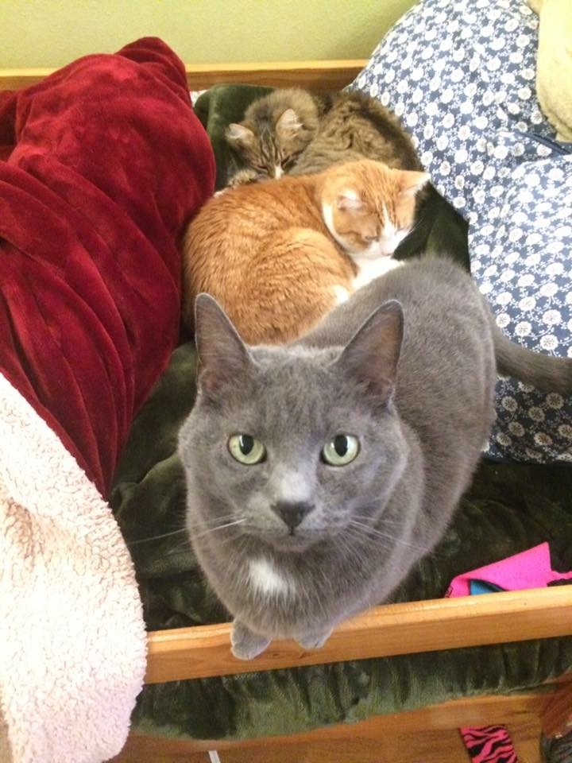

### I wasn't sure what content fill this website with so the About page is going to be a list of things I like, listed in the order I thought of them. 

## Things I Like: 
* **Seasonally Appropriate Poetry**
>I want to do with you what spring does with the cherry trees.

This is from Pablo Neruda's *Every Day You Play* and was not originally written in English.

* **My Cats Who Are Named After Cheeses And Herbs**

the grey one is brie the orange one is cheddar and the tiny fluffy one is rosemary

* **The Wikipedia Page for Chemical Compounds With Unusual Names**

[Click Here, They're Very Funny](https://en.wikipedia.org/wiki/List_of_chemical_compounds_with_unusual_names)

* **Using Italics To Indicate Internal Monologue**

*Five,* I'm thinking to myself as I write this. *Five seems like a good number of things to have in a list.*

* **Finding The Number Of Times The Names Of People I Know Are In Pi And Then Putting That Into A Table**
